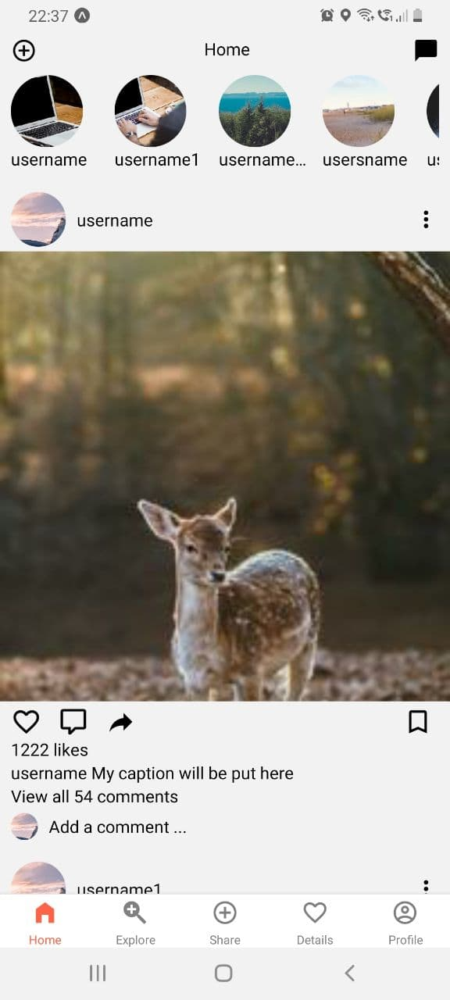
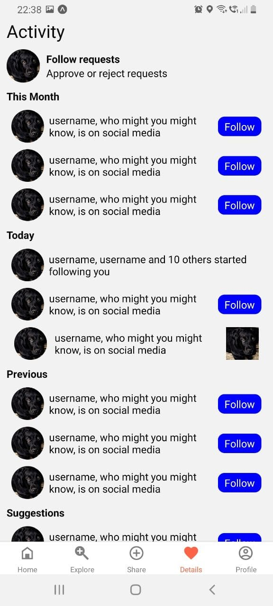
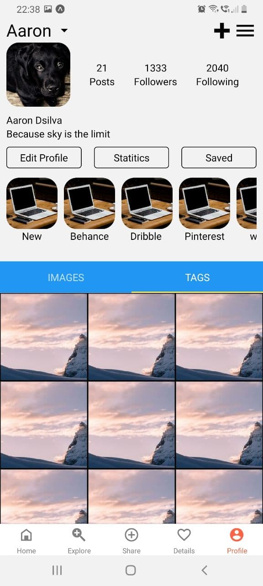

# REACT-NATIVE-SOCIAL-MEDIA-TEMPLATE

> A template for social media app (Instagram like UI).

One to two paragraph statement about your product and what it does.






## Installation

Windows & Linux & Os X:

```sh
git clone https://github.com/AaronDsilva97/react-native-social-media-template.git
```

## Development setup

```sh
expo install
or
npm install
```

```sh
expo start
```
